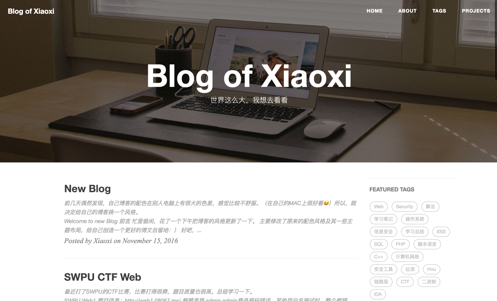

# Xiaoxi's 博客

### 简介

该博客用于个人学习方面的一些知识总结与分享，主要包括Web安全、CTF、开发经验等等，偶尔抽风会更新一波杂谈。

### 致谢

1. 博文主要基于[GitHub Pages](https://pages.github.com/) + [Jekyll](http://jekyllrb.com/)的方式来建立，这里借鉴了[黄玄](https://huangxuan.me/)的个人博客主题，感谢这个作者。你可以从这获得[主题源码](https://github.com/Huxpro/huxblog-boilerplate)。
2. 感谢 Jekyll、Github Pages 和 Bootstrap!

> 如果您有任何建议，欢迎在Github留言或者发邮件给我momomomoxiaoxi@gmail.com：）